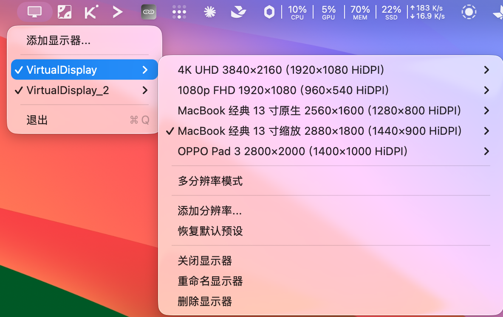
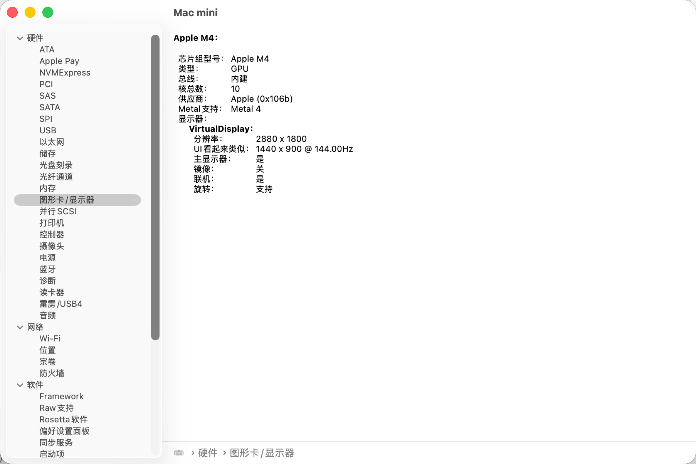

# VirtualDisplay

**简体中文 → [README.md](README.md)**

[](https://www.apple.com/macos/)
[](https://www.swift.org/)
[](LICENSE)
[](../../releases/tag/v5.1.1)

VirtualDisplay is a **minimal, lightweight** macOS menu bar tool that creates virtual displays using private CoreGraphics APIs. No complex settings panels, no background services — it lives in your menu bar and lets you manage multiple virtual displays with a click. Great for remote desktop, screen sharing, and giving a headless Mac a primary display.



> The app UI follows your system language (Chinese / English). This document is the English version of the README.

---

## Table of Contents

- [Features](#features)
- [Use Cases](#use-cases)
- [Requirements](#requirements)
- [Installation](#installation)
- [Usage Examples](#usage-examples)
  - [OPPO Pad 3 Remote](#oppo-pad-3-remote)
  - [4K Remote](#4k-remote)
  - [Headless Mac mini 4K 120Hz](#headless-mac-mini-4k-120hz)
- [Menu Guide](#menu-guide)
- [HiDPI and Resolution Selection](#hidpi-and-resolution-selection)
- [High Refresh Rate](#high-refresh-rate)
- [Command Line Tool vdctl](#command-line-tool-vdctl)
  - [Import / Export Configuration](#import--export-configuration)
- [Comparison with Similar Products](#comparison-with-similar-products)
- [Building from Source](#building-from-source)
- [License](#license)

---

## Features

- **Minimal & lightweight**: pure menu bar app — no Dock icon, no complex settings panels, no extra background processes.
- **Multiple isolated displays**: create multiple virtual displays, each with its own resolution presets and on/off state.
- **Custom resolutions**: any width, height, and high refresh rate (60Hz / 120Hz / 144Hz, etc.).
- **HiDPI by default**: macOS renders at 2×, so the remote side receives a crisp physical-resolution framebuffer.
- **Extended mode by default**: new displays join the desktop without mirroring the main screen.
- **Preset management**: add, edit, delete, restore, and activate resolution presets per display.
- **State persistence**: temporarily turn a display on/off; state is restored on next launch.
- **Launch at login**: enabled by default on first launch — `VirtualDisplay.app` starts at login, no manual login item needed.
- **CLI / agent friendly**: built-in `vdctl` outputs JSON by default, ready for scripting and automation.
- **Free & open source**: MIT license, no payment or subscription.

---

## Use Cases

- **Remote desktop**: give remote clients (UU Remote, RustDesk, VNC, Screen Sharing, etc.) a fixed-resolution virtual display, so the picture doesn't change with your real screen.
- **Tablet/phone casting**: let the remote side render at its native resolution, e.g. the OPPO Pad 3's 2800×2000.
- **Multi-device isolation**: create multiple virtual displays, one per remote target, without interference.
- **Mac mini / headless Mac**: when connecting to a Mac mini without a display attached, macOS usually only offers 1080p or lower — blurry picture, tiny workspace. VirtualDisplay can create a 4K, 8K, or any-resolution display, with a refresh rate you choose (60Hz, 120Hz, 144Hz — whatever the system and remote client support).

Current version: [v5.1.1](../../releases/tag/v5.1.1)

---

## Requirements

- macOS 13.0 or later
- Apple Silicon or Intel Mac

---

## Installation

1. Download `VirtualDisplay.zip` from [Releases](../../releases/latest).
2. Unzip and drag `VirtualDisplay.app` to your Applications folder.
3. Launch it — a display icon appears in the menu bar. "Launch at Login" is enabled automatically on first launch; toggle it in the main menu if needed.

### Setting Up Launch at Login Manually (Legacy or Special Cases)

If the "Launch at Login" toggle doesn't take effect (e.g. due to permissions), you can add a login item manually:

**macOS Ventura and later:**

1. Open System Settings → General → Login Items.
2. Click **+** under "Open at Login".
3. Go to Applications, select `VirtualDisplay.app`, and click Open.

**macOS Monterey and earlier:**

1. Open System Preferences → Users & Groups.
2. Select your user and click the Login Items tab.
3. Click **+**, select `VirtualDisplay.app`, and click Add.

Once added, the VirtualDisplay icon appears in the menu bar at every boot/login and restores the displays to their last saved state.

### "Cannot Be Opened" or "Is Damaged" Warnings

VirtualDisplay is not signed with a paid Apple Developer certificate — release builds use ad-hoc signing and are not notarized. On Macs with Gatekeeper enabled (the default), the first launch may be blocked. This is expected and does not mean the app is broken.

Use any of the following to allow it:

1. In Finder, **right-click (or Control-click)** `VirtualDisplay.app`, choose Open, then click Open again in the confirmation dialog. macOS remembers your choice afterwards.
2. Or open System Settings → Privacy & Security, try launching the app once, and click "Open Anyway" after it gets blocked.
3. If it still won't open, remove the quarantine attribute in Terminal:

   ```bash
   xattr -dr com.apple.quarantine /Applications/VirtualDisplay.app
   ```

> We don't recommend running `sudo spctl --master-disable` to turn off Gatekeeper entirely just for this app; only consider it as a last resort, and re-enable Gatekeeper afterwards.

---

## About

Click "About" at the bottom of the menu bar menu to expand a submenu:

- **VirtualDisplay vX.X.X**: the current version (not clickable).
- **Check for Updates**: manually queries the GitHub Releases API and opens the release page when a new version is available.
- **Sponsor**: shows a WeChat QR code to support the developer.

<p align="center">
  
</p>

- **Feedback**: opens the GitHub new-issue page, pre-filled with the app and macOS versions.
- **Star on GitHub**: opens the project homepage with one click.

Update checks are strictly manual — the app never touches the network on launch.

### OPPO Pad 3 Remote

The OPPO Pad 3 has a 2800×2000 display. To show it natively on the remote side:

1. Click the menu bar icon → **Add Display**, name it `OPPO_Pad`.
2. Open the `OPPO_Pad` submenu → **Add Resolution**.
3. Name `OPPO Pad 3`, width `2800`, height `2000`, FPS `60`.
4. Save and click the preset to select it.
5. In UU Remote, select the `OPPO_Pad` display and choose the **`1400 × 1000 (HiDPI)`** resolution — the remote side gets 2800×2000-equivalent quality.

> HiDPI is on by default: macOS renders internally at 1400×1000 and outputs 2800×2000 scaled up. If your remote client offers a HiDPI option, prefer the logical resolution marked HiDPI; otherwise it shows 2800×2000 directly.

### 4K Remote

1. Open any display submenu → **Add Resolution**.
2. Name `4K UHD`, width `3840`, height `2160`, FPS `60`.
3. Save and select it.
4. After selecting the display on the remote side, prefer the **HiDPI** `1920 × 1080`; if the client doesn't support HiDPI, choose `3840 × 2160` directly.

If fonts look too small on the remote side, adjust the scaling in the remote client — the server is already outputting full 4K.

### Headless Mac mini 4K 120Hz

A Mac mini without a display often only offers 1080p over remote desktop. With VirtualDisplay you can create a 4K high-refresh display:

1. Click the menu bar icon → **Add Display**, name it `MacMini_4K`.
2. Open the submenu → **Add Resolution**.
3. Name `4K 120Hz`, width `3840`, height `2160`, FPS `120`.
4. Save and select it.
5. Connect via VNC / UU Remote / Screen Sharing, choose `MacMini_4K`, and prefer the **HiDPI** `1920 × 1080` resolution.

Same for 8K — just enter `7680 × 4320`.

---

## Menu Guide

- **Physical resolution**: the large numbers in the menu, and the framebuffer size the remote side actually receives. E.g. `4K UHD (3840×2160@60 / 1920×1080 HiDPI)`.
- **Logical resolution**: the HiDPI value in parentheses — the size macOS actually renders the UI at. VirtualDisplay always uses half the physical resolution, so `3840×2160` corresponds to `1920×1080 HiDPI`.
- **FPS**: refresh rate. You can enter any value for custom presets, not just 60.
- **Multi-Resolution Mode**: when off, only one resolution can be selected at a time; when on, multiple presets can be active and all appear in macOS display settings — the first one in the list is the current output.

  Example: a display has both `4K UHD` and `1080p FHD` presets.
  - Multi-Resolution Mode off: only one can be checked in the menu. Click `4K UHD` for 4K output; click `1080p FHD` to switch to 1080p.
  - Multi-Resolution Mode on: both presets appear in the resolution list in System Settings → Displays. You can switch there directly; in the VirtualDisplay menu, the first preset in the list is the actual current output.
- **Turn display on/off**: temporarily takes a virtual display online or offline; the state is remembered. Deleting a display removes its configuration entirely — the last display can't be deleted.
- **Display name**: letters, digits, and underscores only.

---

## HiDPI and Resolution Selection

VirtualDisplay creates all virtual displays in **HiDPI** mode by default.

In short:

- **Physical resolution**: the number of pixels the display actually outputs — the framebuffer size the remote side receives.
- **Logical resolution**: the coordinate system macOS uses to render the UI — half the physical resolution.
- macOS renders at the logical resolution first, then scales the whole thing 2× to the physical resolution, so the UI stays normal-sized while text and icons are razor-sharp.

For example:

| Preset you add | Physical output | macOS internal render | Remote client should choose |
|---|---|---|---|
| 4K UHD | 3840 × 2160 | 1920 × 1080 | **1920 × 1080 HiDPI** |
| OPPO Pad 3 | 2800 × 2000 | 1400 × 1000 | **1400 × 1000 HiDPI** |
| 1080p FHD | 1920 × 1080 | 960 × 540 | **960 × 540 HiDPI** |

In UU Remote, VNC clients, or macOS display settings, you'll usually see two variants:

1. The **logical resolution** marked **HiDPI** (e.g. `1920 × 1080 HiDPI`).
2. The **physical resolution** without the mark (e.g. `3840 × 2160`).

**Prefer the HiDPI-marked logical resolution.** That way macOS renders at 2×, and the remote side receives a crisp 4K framebuffer.

If your remote client doesn't support HiDPI and only lists physical resolutions, choose the physical resolution directly. The remote side still receives the 4K framebuffer — it may just display it 1:1, making the UI small; adjust scaling in the client.

---

## High Refresh Rate

VirtualDisplay has no hard FPS limit — enter any refresh rate when adding a resolution. As long as the system and remote client support it, you get high-refresh output.

The screenshot below shows a virtual display created on a Mac mini, reported by System Information as **2880 × 1800 @ 144Hz**, with a HiDPI logical resolution of **1440 × 900**.



---

## Command Line Tool vdctl

Since v4.0.0, VirtualDisplay ships with the `vdctl` command line tool for scripting and agent automation.

`vdctl` relies on the menu bar app to keep displays alive; if the app isn't running, it automatically launches `/Applications/VirtualDisplay.app`.

```bash
# Show current status
vdctl status

# List displays and presets
vdctl list displays
vdctl list presets VirtualDisplay

# Manage displays
vdctl add display MacMini_4K
vdctl rename display MacMini_4K MacMini_8K
vdctl toggle display MacMini_4K
vdctl remove display MacMini_4K

# Resolution presets
vdctl add preset MacMini_4K "4K 120Hz" 3840 2160 120
vdctl activate preset MacMini_4K "4K 120Hz"
vdctl remove preset MacMini_4K "4K 120Hz"

# Multi-resolution mode
vdctl set multi-resolution MacMini_4K true

# Export / import configuration (v5.0.0+)
vdctl export --path ~/Desktop/vd.json
vdctl export display MacMini_4K --path ~/Desktop/macmini.json
vdctl export preset MacMini_4K "4K 120Hz" --path ~/Desktop/4k120.json
vdctl import --path ~/Desktop/vd.json
vdctl import --path ~/Desktop/vd.json --merge
```

### Import / Export Configuration

Since v5.0.0, configurations can be exported and imported as JSON:

- **Export**:
  - Below "Import Configuration" in the main menu, each display submenu has "Export Display Configuration".
  - Each preset submenu has "Export".
  - `vdctl export` supports full / display / preset scopes.
  - Exported JSON strips hardware identifiers (`vendorID` / `productID` / `serialNumber`) for safe sharing.
- **Import**: "Import Configuration" in the menu, or `vdctl import --path`.
  - **Replace** is the default — a confirmation dialog is shown for menu imports.
  - Use `--merge` to merge into the current configuration; name conflicts get an `_imported` suffix automatically.
  - All display/preset IDs and hardware identifiers are regenerated on import to avoid conflicts.

Exported JSON can be sent to anyone directly — they just use "Import Configuration" to restore it.

Example exported JSON:

```json
{
  "schemaVersion": 1,
  "exportType": "full",
  "exportedAt": "2026-07-09T12:00:00Z",
  "payload": {
    "displays": [
      {
        "name": "MacMini_4K",
        "multiResolutionMode": false,
        "isEnabled": true,
        "activePresetIDs": ["preset-uuid-1"],
        "presets": [
          {
            "id": "preset-uuid-1",
            "name": "4K 120Hz",
            "width": 3840,
            "height": 2160,
            "refreshRate": 120
          }
        ]
      }
    ]
  }
}
```

All commands output JSON by default, write errors to stderr, and exit non-zero on failure. After installation, `vdctl` lives at `/Applications/VirtualDisplay.app/Contents/MacOS/vdctl` and can be linked into your PATH:

```bash
ln -s /Applications/VirtualDisplay.app/Contents/MacOS/vdctl /usr/local/bin/vdctl
```

### Implementation Notes

- Swift 5 + AppKit + CoreGraphics.
- Built on the private `CGVirtualDisplay` API family.
- Each display is identified by a unique `vendorID` / `productID` / `serialNumber` tuple; `serialNumber` only increments and is never reused.
- Configuration is stored as JSON in `UserDefaults` under `appConfigurationV2`.
- The menu checks whether displays are truly online via `CGGetOnlineDisplayList` each time it opens.
- After creating a display, `CGConfigureDisplayMirrorOfDisplay(..., kCGNullDirectDisplay)` is called — non-mirroring by default.

---

## Comparison with Similar Products

| Product | Positioning | Multiple Displays | Custom Resolutions | HiDPI | CLI | Price | Open Source |
|------|------|---------|-------------|-------|---------|------|------|
| **VirtualDisplay** | Lightweight menu bar tool for remote desktop | ✅ Managed independently | ✅ Freely addable | ✅ On by default | ✅ `vdctl`, fully free, JSON output by default | Free | ✅ MIT |
| **BetterDisplay** | All-in-one display management (DDC, HiDPI, virtual screens, etc.) | ✅ | ✅ Pro custom | ✅ | ✅ `betterdisplaycli`, some advanced features require Pro | Free basic / Pro paid | ❌ |

VirtualDisplay has no FPS limit, supports high refresh rates, and supports ultra-high resolutions like 8K — as long as the system and remote client can handle it.

**VirtualDisplay is for you if**:

- You just want a lightweight, quick way to create a few fixed-resolution virtual displays for remote access.
- You don't want to pay or configure a pile of advanced features.
- You need multiple isolated displays — e.g. one Mac serving several remote devices.

**Not currently supported**:

- Display rotation
- Brightness control

> References: [BetterDisplay feature list](https://github.com/waydabber/BetterDisplay/wiki/List-of-free-and-Pro-features), [BetterDisplay website](https://betterdisplay.me/)

---

## Building from Source

```bash
xcodebuild -project VirtualDisplay.xcodeproj -scheme VirtualDisplay -configuration Release build
```

The build product is at `build/Products/Release/VirtualDisplay.app`, with `vdctl` bundled into `VirtualDisplay.app/Contents/MacOS/vdctl`. You can also build the CLI alone:

```bash
xcodebuild -project VirtualDisplay.xcodeproj -scheme vdctl -configuration Release build
```

---

## License

[MIT](LICENSE)
